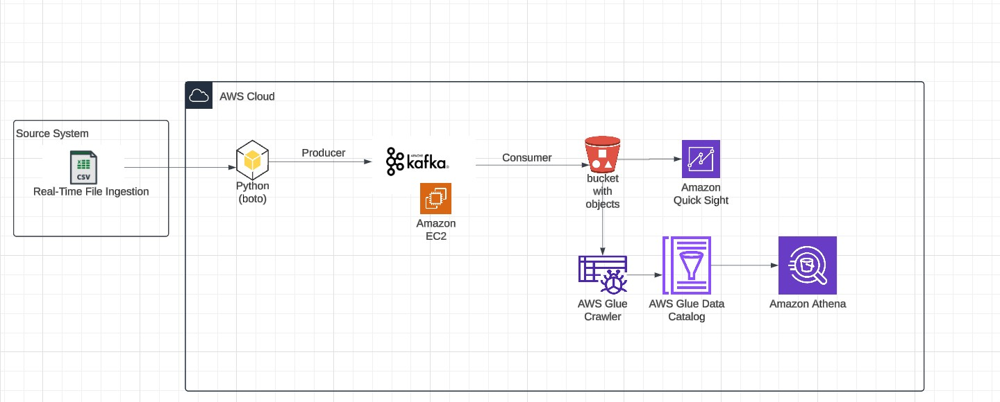

# Bank Lending and Evaluation Kafka Real Time Project

## Introduction 
Using Bank Lending data from different Banks from UK using different technologies such as Python, Amazon Web Services (AWS), Apache Kafka, Glue, Athena, and SQL.

## Architecture 

## Technology Used
- Programming Language - Python
  1. Pandas
  2. Numpy
  3. Seaborn
- Amazon Web Service (AWS)
1. S3 (Simple Storage Service)
2. Athena
3. Glue Crawler
4. Glue Catalog
5. EC2
- Apache Kafka

###
Procedure:
1. Set up the data ingestion from the source system
2. Perform data vizualization and summarization to analysis the data
3. Perform data wrangling and feature engineering
4. Set up ETL pipeline to push the data from source to S3 to store the object.
5. Establish Kafka producer and consumer to perform real-time streaming of data on EC2 instance.
6. Pull the data from S3 in json format using Glue Crawler
7. Analysis the data on the serving side if the data is ready for analysis on the downstream systems.
